# SIP Conference Call Flow

## Three-Way Conference Setup via FreeSWITCH

This diagram illustrates the SIP signaling flow for establishing a three-way conference call where party B initiates the conference by first calling A, then placing A on hold, calling C, and finally merging all parties into a conference room.

```mermaid
sequenceDiagram
    autonumber

    participant A as A (Caller)
    participant FS as FreeSWITCH
    participant B as B (Called Party)
    participant C as C (Third Party)

    %% Phase 1: Initial Call Setup
    Note over A,C: 📞 Phase 1: A calls B
    A->>FS: INVITE (call to B)
    FS->>B: INVITE
    B->>FS: 180 Ringing
    FS->>A: 180 Ringing
    B->>FS: 200 OK (SDP answer)
    FS->>A: 200 OK (SDP answer)
    A->>FS: ACK
    FS->>B: ACK

    rect rgb(200, 255, 200)
        Note over A,B: 🔊 RTP Media Flow Established<br/>A and B are in conversation
    end

    %% Phase 2: Hold Operation
    Note over A,C: ⏸️ Phase 2: B places A on hold
    B->>FS: re-INVITE (SDP: a=sendonly)
    FS->>A: re-INVITE (SDP: a=recvonly)
    A->>FS: 200 OK
    FS->>B: 200 OK
    B->>FS: ACK
    FS->>A: ACK

    rect rgb(255, 255, 200)
        Note over A,B: 🎵 A hears hold music<br/>Media stream paused
    end

    %% Phase 3: Second Call Setup
    Note over A,C: 📞 Phase 3: B calls C
    B->>FS: INVITE (new call to C)
    FS->>C: INVITE
    C->>FS: 180 Ringing
    FS->>B: 180 Ringing
    C->>FS: 200 OK (SDP answer)
    FS->>B: 200 OK (SDP answer)
    B->>FS: ACK
    FS->>C: ACK

    rect rgb(200, 200, 255)
        Note over B,C: 🔊 B and C are talking<br/>(A remains on hold)
    end

    %% Phase 4: Conference Setup via REFER
    Note over A,C: 🔀 Phase 4: B creates conference using REFER

    %% Transfer A to conference
    B->>FS: REFER (transfer A)<br/>Refer-To: sip:3000@freeswitch
    FS->>B: 202 Accepted
    FS->>B: NOTIFY (100 Trying)
    B->>FS: 200 OK (for NOTIFY)

    Note over FS: ✅ FreeSWITCH moves A to conference 3000

    FS->>B: NOTIFY (200 OK - Transfer complete)
    B->>FS: 200 OK (for NOTIFY)

    %% Transfer C to conference
    B->>FS: REFER (transfer C)<br/>Refer-To: sip:3000@freeswitch
    FS->>B: 202 Accepted
    FS->>B: NOTIFY (100 Trying)
    B->>FS: 200 OK (for NOTIFY)

    Note over FS: ✅ FreeSWITCH moves C to conference 3000

    FS->>B: NOTIFY (200 OK - Transfer complete)
    B->>FS: 200 OK (for NOTIFY)

    %% Phase 5: B Joins Conference
    Note over A,C: 👥 Phase 5: B joins conference
    B->>FS: INVITE (sip:3000@freeswitch)
    FS->>B: 200 OK (SDP answer)
    B->>FS: ACK

    Note over FS: 🎯 Conference 3000: 3 participants active

    rect rgb(255, 220, 220)
        Note over A,C: 🗣️ Three-Way Conference Active<br/>A, B, and C are all connected<br/>Full duplex audio between all parties
    end

    %% Final state
    Note over A,C: ✅ Conference successfully established
```

## Key SIP Elements

### Messages Used:
- **INVITE**: Initiates calls and joins conference
- **re-INVITE**: Modifies existing session (hold/unhold)
- **REFER**: Transfers calls to conference room
- **NOTIFY**: Updates REFER status
- **ACK**: Confirms session establishment

### SDP Attributes for Hold:
- `a=sendonly`: Caller can send but not receive media
- `a=recvonly`: Caller can receive but not send media
- `a=sendrecv`: Normal bidirectional media (default)
- `a=inactive`: No media in either direction

### Conference Room:
- Extension: 3000 (configurable in FreeSWITCH dialplan)
- Type: Ad-hoc conference room
- Mixing: Server-side audio mixing by FreeSWITCH